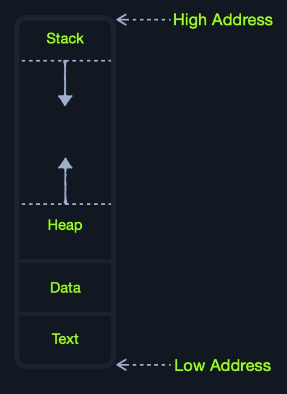

# Cache

| **Level**   | **Description**                                                                                      |
| ----------------- | ---------------------------------------------------------------------------------------------------------- |
| `Level 1 Cache` | Usually in kilobytes, the fastest memory available, located in each CPU core. (Only registers are faster.) |
| `Level 2 Cache` | Usually in megabytes, extremely fast (but slower than L1), shared between all CPU cores.                   |
| `Level 3 Cache` | Usually in megabytes (larger than L2), faster than RAM but slower than L1/L2. (Not all CPUs use L3.)       |



| Segment   | Description                                                                                                                                                                                      |
| --------- | ------------------------------------------------------------------------------------------------------------------------------------------------------------------------------------------------ |
| `Stack` | Has a Last-in First-out (LIFO) design and is fixed in size. Data in it can only be accessed in a specific order by push-ing and pop-ing data.                                                    |
| `Heap`  | Has a hierarchical design and is therefore much larger and more versatile in storing data, as data can be stored and retrieved in any order. However, this makes the heap slower than the Stack. |
| `Data`  | Has two parts:`Data`, which is used to hold variables, and `.bss`, which is used to hold unassigned variables (i.e., buffer memory for later allocation).                                    |
| `Text`  | Main assembly instructions are loaded into this segment to be fetched and executed by the CPU.                                                                                                   |

Although this segmentation applies to the entire RAM, `each application is allocated its Virtual Memory when it is run`. This means that each application would have its own `stack`, `heap`, `data`, and `text` segments.

| Component     | Speed                             | Size                |
| ------------- | --------------------------------- | ------------------- |
| `Registers` | Fastest                           | Bytes               |
| `L1 Cache`  | Fastest, other than Registers     | Kilobytes           |
| `L2 Cache`  | Very fast                         | Megabytes           |
| `L3 Cache`  | Fast, but slower than the above   | Megabytes           |
| `RAM`       | Much slower than all of the above | Gigabytes-Terabytes |
| `Storage`   | Slowest                           | Terabytes and more  |

An instruction cycle consists of four stages: `Fetch`, `Decode`, `Execute`, and `Store`:

| **Instruction** | **Description**                                                                                                                       |
| --------------------- | ------------------------------------------------------------------------------------------------------------------------------------------- |
| `1. Fetch`          | Takes the next instruction's address from the `Instruction Address Register` (IAR), which tells it where the next instruction is located. |
| `2. Decode`         | Takes the instruction from the IAR, and decodes it from binary to see what is required to be executed.                                      |
| `3. Execute`        | Fetch instruction operands from register/memory, and process the instruction in the `ALU` or `CU`.                                      |
| `4. Store`          | Store the new value in the destination operand.                                                                                             |

All of the stages in the instruction cycle are carried out by the Control Unit, except when arithmetic instructions need to be executed "add, sub, ..etc", which are executed by the ALU.

Each Instruction Cycle takes multiple clock cycles to finish, depending on the CPU architecture and the complexity of the instruction. Once a single instruction cycle ends, the CU increments to the next instruction and runs the same cycle on it, and so on.

For example, if we were to execute the assembly instruction `add rax, 1`, it would run through an instruction cycle:

1. Fetch the instruction from the `rip` register, `48 83 C0 01` (in binary).
2. Decode '`48 83 C0 01`' to know it needs to perform an `add` of `1` to the value at `rax`.
3. Get the current value at `rax` (by `CU`), add `1` to it (by the `ALU`).
4. Store the new value back to `rax`.

An `Instruction Set Architecture` (`ISA`) specifies the syntax and semantics of the assembly language on each architecture. It is not just a different syntax but is built in the core design of a processor, as it affects the way and order instructions are executed and their level of complexity. `ISA` mainly consists of the following components:

* Instructions
* Registers
* Memory Addresses
* Data Types

| Component            | Description                                                                                                                  | Example                                        |
| -------------------- | ---------------------------------------------------------------------------------------------------------------------------- | ---------------------------------------------- |
| `Instructions`     | The instruction to be processed in the `opcode operand_list` format. There are usually 1,2, or 3 comma-separated operands. | `add rax, 1`, `mov rsp, rax`, `push rax` |
| `Registers`        | Used to store operands, addresses, or instructions temporarily.                                                              | `rax`, `rsp`, `rip`                      |
| `Memory Addresses` | The address in which data or instructions are stored. May point to memory or registers.                                      | `0xffffffffaa8a25ff`, `0x44d0`, `$rax`   |
| `Data Types`       | The type of stored data.                                                                                                     | `byte`, `word`, `double word`            |

These are the main components that distinguish different ISA's and assembly languages. We will cover each of them in more depth in the coming sections, and we'll learn how to use various instructions.

There are two main Instruction Set Architectures that are widely used:

1. `Complex Instruction Set Computer` (`CISC`) - Used in `Intel` and `AMD` processors in most computers and servers.
2. `Reduced Instruction Set Computer` (`RISC`) - Used in `ARM` and `Apple` processors, in most smartphones, and some modern laptops.

The following table summarizes the main differences between CISC and RISC:

| Area                               | CISC                                                        | RISC                                                |
| ---------------------------------- | ----------------------------------------------------------- | --------------------------------------------------- |
| `Complexity`                     | Favors complex instructions                                 | Favors simple instructions                          |
| `Length of instructions`         | Longer instructions - Variable length 'multiples of 8-bits' | Shorter instructions - Fixed length '32-bit/64-bit' |
| `Total instructions per program` | Fewer total instructions - Shorter code                     | More total instructions - Longer code               |
| `Optimization`                   | Relies on hardware optimization (in CPU)                    | Relies on software optimization (in Assembly)       |
| `Instruction Execution Time`     | Variable - Multiple clock cycles                            | Fixed - One clock cycle                             |
| `Instructions supported by CPU`  | Many instructions (~1500)                                   | Fewer instructions (~200)                           |
| `Power Consumption`              | High                                                        | Very low                                            |
| `Examples`                       | Intel, AMD                                                  | ARM, Apple                                          |

There are two main types of registers we will be focusing on: `Data Registers` and `Pointer Registers`.

| **Data Registers** | **Pointer Registers** |
| ------------------------ | --------------------------- |
| `rax`                  | `rbp`                     |
| `rbx`                  | `rsp`                     |
| `rcx`                  | `rip`                     |
| `rdx`                  |                             |
| `r8`                   |                             |
| `r9`                   |                             |
| `r10`                  |                             |

* `Data Registers` - are usually used for storing instructions/syscall arguments. The primary data registers are: `rax`, `rbx`, `rcx`, and `rdx`. The `rdi` and `rsi` registers also exist and are usually used for the instruction `destination` and `source` operands. Then, we have secondary data registers that can be used when all previous registers are in use, which are `r8`, `r9`, and `r10`.
* `Pointer Registers` - are used to store specific important address pointers. The main pointer registers are the Base Stack Pointer `rbp`, which points to the beginning of the Stack, the Current Stack Pointer `rsp`, which points to the current location within the Stack (top of the Stack), and the Instruction Pointer `rip`, which holds the address of the next instruction.

Each `64-bit` register can be further divided into smaller sub-registers containing the lower bits, at one byte `8-bits`, 2 bytes `16-bits`, and 4 bytes `32-bits`. Each sub-register can be used and accessed on its own, so we don't have to consume the full 64-bits if we have a smaller amount of data.


Sub-registers can be accessed as:

| Size in bits | Size in bytes | Name                                     | Example |
| ------------ | ------------- | ---------------------------------------- | ------- |
| `16-bit`   | `2 bytes`   | the base name                            | `ax`  |
| `8-bit`    | `1 bytes`   | base name and/or ends with `l`         | `al`  |
| `32-bit`   | `4 bytes`   | base name + starts with the `e` prefix | `eax` |
| `64-bit`   | `8 bytes`   | base name + starts with the `r` prefix | `rax` |

For example, for the `bx` data register, the 16-bit is `bx`, so the 8-bit is `bl`, the 32-bit would be `ebx`, and the 64-bit would be `rbx`. The same goes for pointer registers. If we take the base stack pointer `bp`, its 16-bit sub-register is `bp`, so the 8-bit is `bpl`, the 32-bit is `ebp`, and the 64-bit is `rbp`.


Syscall Calling Convention

Now that we understand how to locate various syscall and their arguments let's start learning how to call them. To call a syscall, we have to:

1. Save registers to stack
2. Set its syscall number in `rax`
3. Set its arguments in the registers
4. Use the syscall assembly instruction to call it

The following are the names of the sub-registers for all of the essential registers in an x86_64 architecture:

| Description                        | 64-bit Register | 32-bit Register | 16-bit Register | 8-bit Register |
| ---------------------------------- | --------------- | --------------- | --------------- | -------------- |
| **Data/Arguments Registers** |                 |                 |                 |                |
| Syscall Number/Return value        | `rax`         | `eax`         | `ax`          | `al`         |
| Callee Saved                       | `rbx`         | `ebx`         | `bx`          | `bl`         |
| 1st arg - Destination operand      | `rdi`         | `edi`         | `di`          | `dil`        |
| 2nd arg - Source operand           | `rsi`         | `esi`         | `si`          | `sil`        |
| 3rd arg                            | `rdx`         | `edx`         | `dx`          | `dl`         |
| 4th arg - Loop counter             | `rcx`         | `ecx`         | `cx`          | `cl`         |
| 5th arg                            | `r8`          | `r8d`         | `r8w`         | `r8b`        |
| 6th arg                            | `r9`          | `r9d`         | `r9w`         | `r9b`        |
| **Pointer Registers**        |                 |                 |                 |                |
| Base Stack Pointer                 | `rbp`         | `ebp`         | `bp`          | `bpl`        |
| Current/Top Stack Pointer          | `rsp`         | `esp`         | `sp`          | `spl`        |
| Instruction Pointer 'call only'    | `rip`         | `eip`         | `ip`          | `ipl`        |

| Addressing Mode | Description                                                        | Example                             |
| --------------- | ------------------------------------------------------------------ | ----------------------------------- |
| `Immediate`   | The value is given within the instruction                          | `add 2`                           |
| `Register`    | The register name that holds the value is given in the instruction | `add rax`                         |
| `Direct`      | The direct full address is given in the instruction                | `call 0xffffffffaa8a25ff`         |
| `Indirect`    | A reference pointer is given in the instruction                    | `call 0x44d000` or `call [rax]` |
| `Stack`       | Address is on top of the stack                                     | `add rsp`                         |

In the above table, lower is slower. The less immediate the value is, the slower it is to fetch it.

The following table demonstrates how endianness works:

| **Address**       | **0** | **1** | **2** | **3** | **4** | **5** | **6** | **7** | **Address Value** |
| ----------------------- | ----------- | ----------- | ----------- | ----------- | ----------- | ----------- | ----------- | ----------- | ----------------------- |
| **Little Endian** | 77          | 66          | 55          | 44          | 33          | 22          | 11          | 00          | 0x7766554433221100      |
| **Big Endian**    | 00          | 11          | 22          | 33          | 44          | 55          | 66          | 77          | 0x0011223344556677      |

| Component               | Length            | Example                |
| ----------------------- | ----------------- | ---------------------- |
| `byte`                | 8 bits            | `0xab`               |
| `word`                | 16 bits - 2 bytes | `0xabcd`             |
| `double word (dword)` | 32 bits - 4 bytes | `0xabcdef12`         |
| `quad word (qword)`   | 64 bits - 8 bytes | `0xabcdef1234567890` |

| Sub-register | Data Type |
| ------------ | --------- |
| `al`       | `byte`  |
| `ax`       | `word`  |
| `eax`      | `dword` |
| `rax`      | `qword` |

| Instruction | Description                                  | Example                                       |
| ----------- | -------------------------------------------- | --------------------------------------------- |
| `mov`     | Move data or load immediate data             | `mov rax, 1` -> `rax = 1`                 |
| `lea`     | Load an address pointing to the value        | `lea rax, [rsp+5]` -> `rax = rsp+5`       |
| `xchg`    | Swap data between two registers or addresses | `xchg rax, rbx` -> `rax = rbx, rbx = rax` |

| **Instruction** | **Description**                          | **Example** |
| --------------------- | ---------------------------------------------- | ----------------- |
| `jmp`               | Jumps to specified label, address, or location | `jmp loop`      |

| **Instruction** | **Condition** | **Description**                                |
| --------------------- | ------------------- | ---------------------------------------------------- |
| `jz`                | `D = 0`           | Destination `equal to Zero`                        |
| `jnz`               | `D != 0`          | Destination `Not equal to Zero`                    |
| `js`                | `D < 0`           | Destination `is Negative`                          |
| `jns`               | `D >= 0`          | Destination `is Not Negative` (i.e. 0 or positive) |
| `jg`                | `D > S`           | Destination `Greater than` Source                  |
| `jge`               | `D >= S`          | Destination `Greater than or Equal` Source         |
| `jl`                | `D < S`           | Destination `Less than` Source                     |
| `jle`               | `D <= S`          | Destination `Less than or Equal` Source            |

To call a syscall, we have to:

1. Save registers to stack
2. Set its syscall number in `rax`
3. Set its arguments in the registers
4. Use the syscall assembly instruction to call it

# Assembly and related instructions

## Assemble and link program

```shell-session
nasm -f elf64 helloWorld.s
```

Note: The `-f elf64` flag is used to note that we want to assemble a 64-bit assembly code. If we wanted to assemble a 32-bit code, we would use `-f elf`.

This should output a `helloWorld.o` object file, which is then assembled into machine code, along with the details of all variables and sections. This file is not executable just yet.

This is why a Linux binary is called `ELF`, which stands for an `Executable and Linkable Format`. To link a file using `ld`, we can use the following command:

```shell-session
StavreAcad@htb[/htb]$ ld -o helloWorld helloWorld.o
```

Note: if we were to assemble a 32-bit binary, we need to add the '`-m elf_i386`' flag.

We have successfully assembled and linked our first assembly file. We will be assembling, linking, and running our code frequently through this module, so let us build a simple `bash` script to make it easier:

Code: **bash**

```bash
#!/bin/bash

fileName="${1%%.*}" # remove .s extension

nasm -f elf64 ${fileName}".s"
ld ${fileName}".o" -o ${fileName}
[ "$2" == "-g" ] && gdb -q ${fileName} || ./${fileName}
```

Now we can write this script to `assembler.sh`, `chmod +x` it, and then run it on our assembly file. It will assemble it, link it, and run it:

```shell-session
StavreAcad@htb[/htb]$ ./assembler.sh helloWorld.s
Hello HTB Academy!
```

## Dissasemble

To disassemble a file, we will use the `objdump` tool, which dumps machine code from a file and interprets the assembly instruction of each hex code. We can disassemble a binary using the `-D` flag.

Note: we will also use the flag `-M intel`, so that `objdump` would write the instructions in the Intel syntax, which we are using, as we discussed before.

Let's start by disassembling our final `ELF` executable file:

```shell-session
StavreAcad@htb[/htb]$ objdump -M intel -d helloWorld
```

If we wanted to only show the assembly code, without machine code or addresses, we could add the `--no-show-raw-insn --no-addresses` flags, as follows:

```shell-session
StavreAcad@htb[/htb]$ objdump -M intel --no-show-raw-insn --no-addresses -d helloWorld

helloWorld:     file format elf64-x86-64

Disassembly of section .text:

<_start>:
        mov    eax,0x1
        mov    edi,0x1
        movabs rsi,0x402000
        mov    edx,0x12
        syscall 
        mov    eax,0x3c
        mov    edi,0x0
        syscall
```

The `-d` flag will only disassemble the `.text` section of our code. To dump any strings, we can use the `-s` flag, and add `-j .data` to only examine the `.data` section. This means that we also do not need to add `-M intel`. The final command is as follows:

```shell-session
StavreAcad@htb[/htb]$ objdump -sj .data helloWorld

helloWorld:     file format elf64-x86-64

Contents of section .data:
 402000 48656c6c 6f204854 42204163 6164656d  Hello HTB Academ
 402010 7921                                 y!
```

## Debugging

GDB is installed in many Linux distributions, and it is also installed by default in Parrot OS and PwnBox. In case it is not installed in your VM, you can use `apt` to install it with the following commands:

```shell-session
StavreAcad@htb[/htb]$ sudo apt-get update
StavreAcad@htb[/htb]$ sudo apt-get install gdb
```

One of the great features of `GDB` is its support for third-party plugins. An excellent plugin that is well maintained and has good documentation is [GEF](https://github.com/hugsy/gef). GEF is a free and open-source GDB plugin that is built precisely for reverse engineering and binary exploitation. This fact makes it a great tool to learn.

To add GEF to GDB, we can use the following commands:

```shell-session
StavreAcad@htb[/htb]$ wget -O ~/.gdbinit-gef.py -q https://gef.blah.cat/py
StavreAcad@htb[/htb]$ echo source ~/.gdbinit-gef.py >> ~/.gdbinit
```
